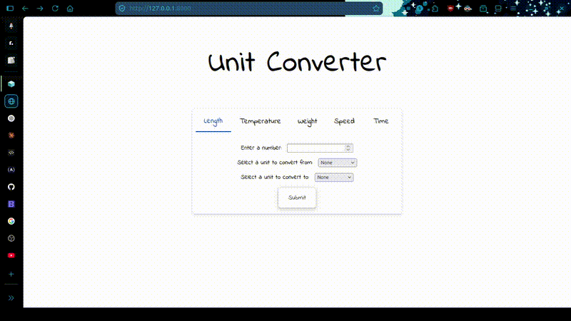

# UnitConverter
This project is inspired by the roadmap.sh [django-project](https://roadmap.sh/projects/unit-converter). The goal behind completing this project is to enhance my knowledge and skill in the direction for a software engineer.
# Features
This web app utilizes django as the backend technology and html, css, and javascript as frontend technologies. These are the features that I tried to give this app:
1. Tab Separated Unit Conversion Type
2. Gives result of conversion in different page.
3. Shows steps of conversion.
4. 5 different conversion types.
# Demo

